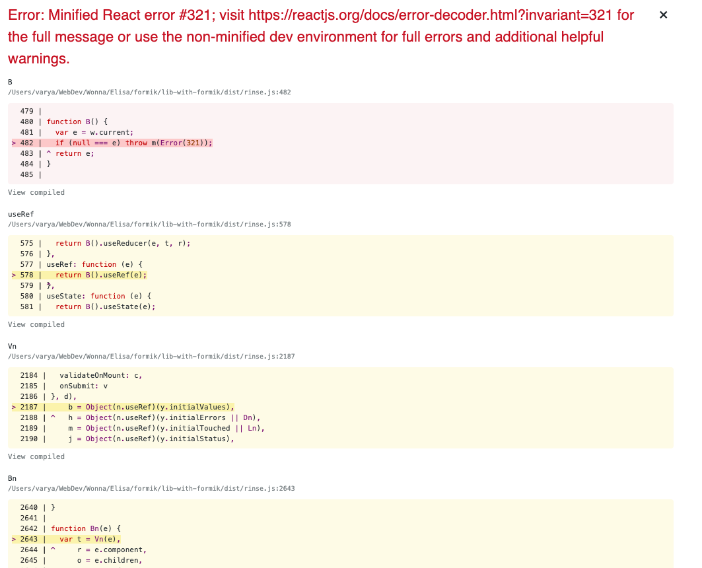

## 1. See the component

1. `git clone git@github.com:varya/lib-with-formik.git`
1. `cd lib-with-formik`
1. `yarn`
1. `yarn storybook`

## 2. Build the library

1. `yarn build`
1. `yarn link`

## 3. The example app

1. `git clone git@github.com:varya/app-with-lib-with-formik.git`
1. `cd app-with-lib-with-formik`
1. `yarn`
1. `yarn link lib-with-formik`
1. `yarn start`

## Error

